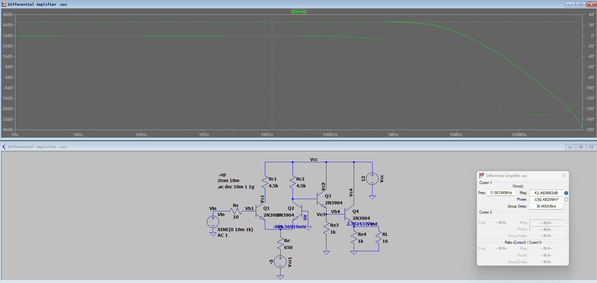

# analogue circuit

this work was to design an amplifier with BJT, the requirement was:

- [x] Total supply voltage: 12 V – 15 V
- [x] Input signal voltage: 20 mVpp
- [x] Gain: > 42 dB
- [x] Lower cut-off frequency: 0 – 100 Hz
- [x] Upper cut-off frequency: 500 kHz – 5 MHz
- [x] Load resistance: 16 Ω

`the simulation was done in LTspice`

