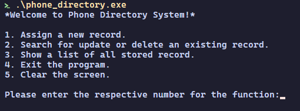

# phone book

this work was to design a phonebook using a terminal application with some basic features using **C** programming

### features
- [menu](./showcase/menu.png)
- [add/remove](./showcase/assign.png)
- [search](./showcase/search.png)
- [list](./showcase/list.png)
